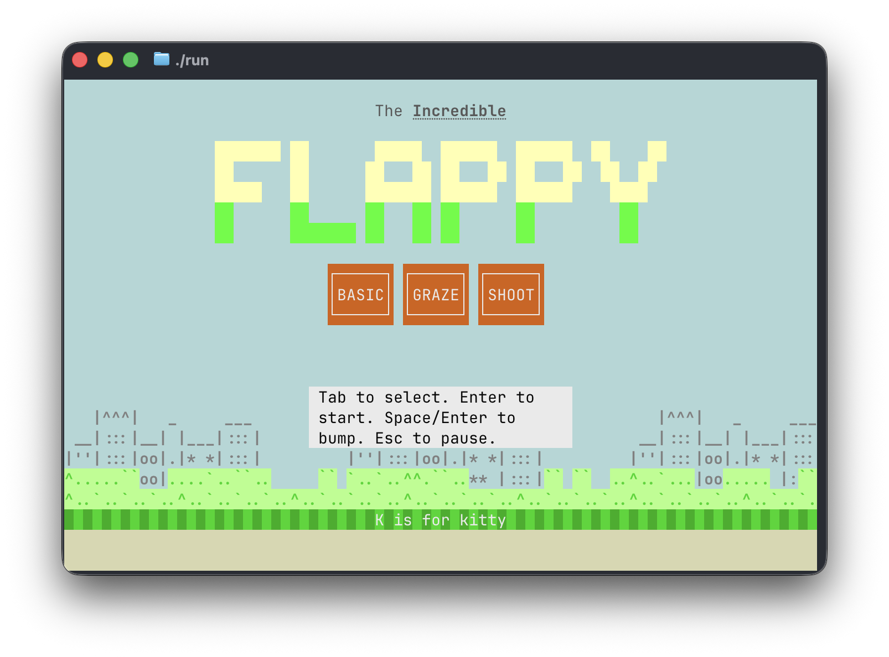
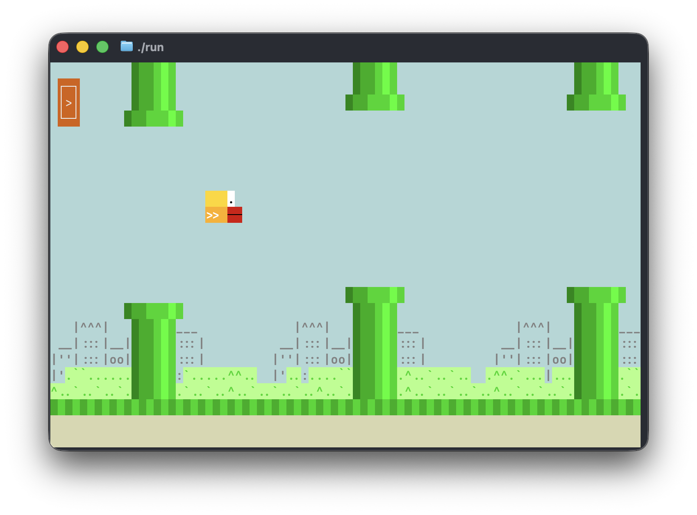
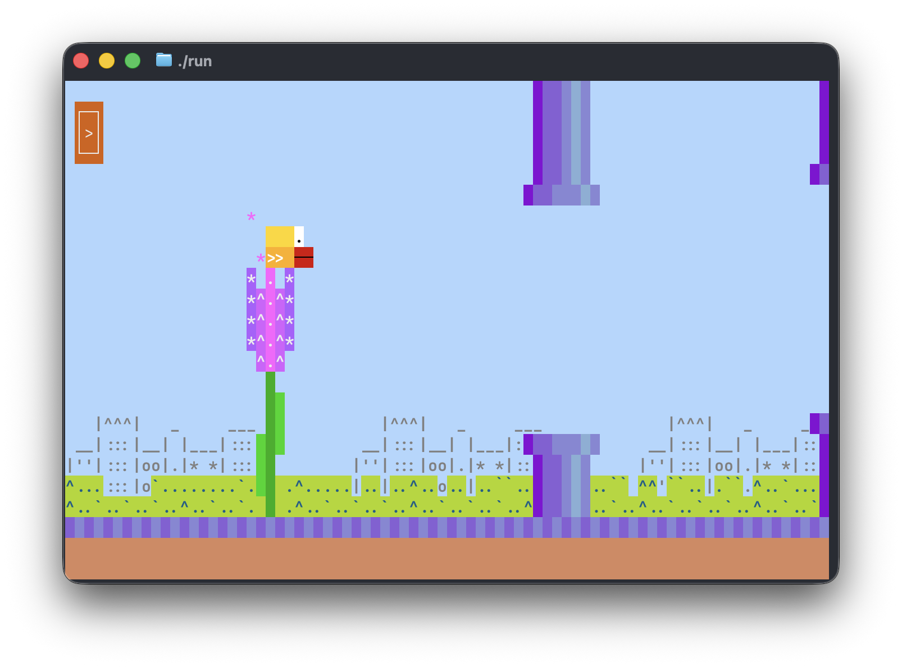
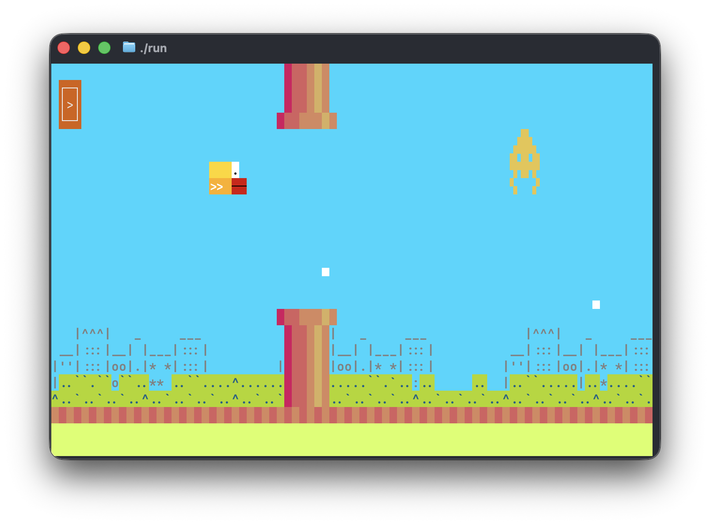

# Incredible Flappy

Flappy Bird for your terminal, with three ways to play: dodge the pipes, graze the flowers, or shoot the invaders.

It can be played in the terminal, using native macOS and Windows app or [right here in the browser](https://ronilan.github.io/incredible-flappy/). It's written in [Rust](https://www.rust-lang.org/) using the [Incredible](https://www.incredible.rs/) TUI framework. Inspired by (meaning parts lifted verbatim) [Impossible Flappy](https://asciinema.org/a/370006).

<p align=center></p>

# Install

## Web

No install needed: https://ronilan.github.io/incredible-flappy/

## Native binaries

Prebuilt binaries are provided for each [release](https://github.com/ronilan/incredible-flappy/releases).

## Linux via Docker

To try the Linux terminal version, build and run:

```
docker build -t incredible_flappy .
docker run --rm -it incredible_flappy
```

Type `incredible_flappy` in the container shell to launch.

## TUI Install / Uninstall

Installs the latest release binary — `/usr/local/bin` (macOS/Linux) or `C:\Program Files\incredible-flappy` (Windows).

```bash
curl --proto '=https' --tlsv1.2 -sSf https://raw.githubusercontent.com/ronilan/incredible-flappy/main/install.sh | bash
```

```powershell
irm https://raw.githubusercontent.com/ronilan/incredible-flappy/main/install.ps1 | iex
```

Uninstall the same way with `uninstall.sh` / `uninstall.ps1`. 

# Play

Pick a game on the splash screen with Tab, then Enter to start. Clicking a game starts it directly. The ← button (top left) goes back to splash.

- **BASIC** — classic flappy. Thread the pipe gaps, one point per gap.
- **GRAZE** — flowers grow instead of some pipes. Land on a bud for a point, but bumping one kills you. Passing flowers pays nothing.
- **SHOOT** — pipes plus roaming alien pairs. Every boost also fires a bullet: kills score, pipes swallow bullets.

## Controls

- Tab to select
- Enter / Space / click — flap
- K — kitty mode
- Esc — pause in flight, Enter resumes
- Mouse works

## Files

Settings (kitty mode) and best scores are kept in a `.incredible-flappy` file under the OS app-data directory:

- macOS: `~/Library/Application Support/incredible-flappy/.incredible-flappy`
- Linux: `~/.local/share/incredible-flappy/.incredible-flappy` (or `$XDG_DATA_HOME/incredible-flappy/.incredible-flappy`)
- Windows: `C:\Users\<you>\AppData\Roaming\incredible-flappy\.incredible-flappy`

# Development

See [Development](./markdowns/DEVELOPMENT.md) and [Development Environment Prerequisites](./markdowns/DEVELOPMENT_PREREQUISITES.md)

---

*Fabriqué au Canada : Made in Canada 🇨🇦*
